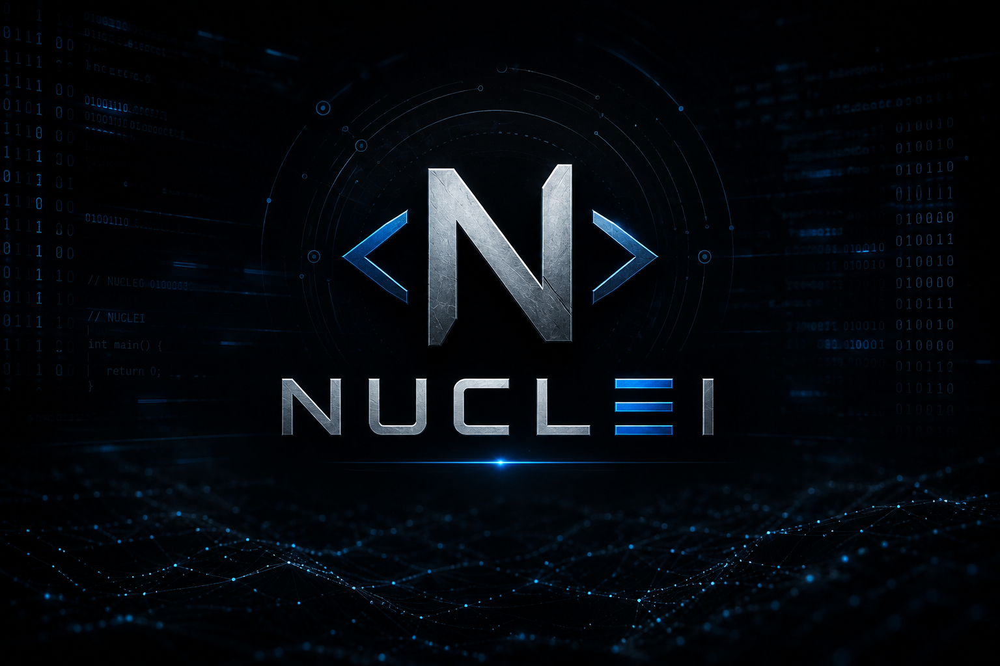

# 🛡️ Nuclei Guide — Guía Técnica de Escaneo de Vulnerabilidades



> Guía técnica y laboratorio práctico sobre **Nuclei**, el escáner de vulnerabilidades basado en
> templates de ProjectDiscovery, orientado a flujos reales de reconocimiento y análisis de
> vulnerabilidades web.

---

## 📌 ¿Qué encontrarás aquí?

Este repositorio documenta, de forma progresiva, cómo integrar **Nuclei** dentro de un flujo de
trabajo real de reconocimiento y análisis de vulnerabilidades:

- Fundamentos de la herramienta y su instalación.
- Un *cheatsheet* con los comandos más usados en el día a día.
- Un laboratorio práctico reproducible con Kali Linux y bWAPP sobre Docker.
- Cómo escribir **plantillas Nuclei personalizadas** cuando el objetivo no está cubierto por el
  repositorio público de templates.
- **Funcionalidades avanzadas y poco documentadas** (detección OOB con Interactsh, encadenado de
  peticiones autenticadas, `flow`, firma de templates, workflows), explicadas a partir de
  problemas reales encontrados en este mismo laboratorio, no como resumen de la documentación
  oficial.
- Documentación de hallazgos con plantilla lista para usar.
- Un análisis honesto de las limitaciones de la herramienta y su comparación con escáneres
  comerciales como Nessus u OpenVAS.

---

## 🔍 ¿Qué es Nuclei?

[Nuclei](https://github.com/projectdiscovery/nuclei) es un escáner de vulnerabilidades de código
abierto desarrollado por **ProjectDiscovery**, escrito en Go. A diferencia de los escáneres
tradicionales monolíticos, Nuclei funciona mediante **templates en YAML**: pequeños ficheros
declarativos que describen una petición, una condición de vulnerabilidad y una forma de
verificarla (matchers).

Esto lo convierte en una herramienta:

- **Extensible**: cualquiera puede escribir o adaptar un template nuevo.
- **Rápida**: pensada para escanear a gran escala con concurrencia configurable.
- **Comunitaria**: cuenta con miles de templates mantenidos activamente, cubriendo CVEs,
  exposiciones de configuración, paneles por defecto, misconfiguraciones, etc.
- **Integrable**: se combina de forma natural con otras herramientas del ecosistema
  ProjectDiscovery (`subfinder`, `httpx`, `naabu`, etc.) para formar pipelines de reconocimiento.

---

## 🗂️ Estructura del repositorio

```
nuclei-guide/
├── README.md                  # Este archivo
├── docs/
│   ├── instalacion.md         # Instalación (Go, binario, Docker) y actualización de templates
│   ├── cheatsheet.md          # Comandos esenciales de Nuclei
│   ├── limitaciones.md        # Falsos positivos, comparativa con Nessus/OpenVAS
│   ├── plantillas-personalizadas.md  # Cómo escribir tus propias plantillas Nuclei
│   └── funcionalidades-avanzadas.md  # OOB/Interactsh, cookie-reuse, flow, firma, workflows
├── labs/
│   ├── lab-setup.md           # Arquitectura del laboratorio (Kali + bWAPP en Docker)
│   ├── ejecucion.md           # Pasos del escaneo real
│   └── hallazgos.md           # Plantilla de documentación de findings
├── scripts/
│   └── pipeline.sh            # Script que encadena subfinder -> httpx -> nuclei
├── custom-templates/          # Plantillas Nuclei propias para los módulos de bWAPP
├── images/                    # Capturas del laboratorio (placeholders, ver labs/*)
└── LICENSE                    # Licencia MIT
```

---

## ⚡ Comandos básicos

```bash
# Escaneo simple contra un único objetivo
nuclei -u https://target.local

# Escaneo contra una lista de objetivos
nuclei -l targets.txt

# Filtrar por severidad
nuclei -l targets.txt -s critical,high

# Filtrar por categoría (tags)
nuclei -l targets.txt -tags cve,exposure

# Exportar resultados en JSON
nuclei -l targets.txt -jsonl -o resultados.jsonl
```

Consulta el listado completo de comandos y flags en [`docs/cheatsheet.md`](docs/cheatsheet.md).

---

## 🚧 Limitaciones

Nuclei **no es un sustituto** de un escáner de vulnerabilidades enterprise ni de una revisión
manual. Algunos puntos clave (desarrollados en [`docs/limitaciones.md`](docs/limitaciones.md)):

- **Úsalo para**: reconocimiento rápido, detección de CVEs conocidos, exposiciones de
  configuración, validación continua en pipelines CI/CD, triage inicial en un pentest.
- **No lo uses como única herramienta en**: auditorías de cumplimiento normativo (PCI-DSS, ISO
  27001), análisis de lógica de negocio, o como reemplazo total de un escáner comercial en
  entornos regulados.
- Depende completamente de la calidad y actualización de sus templates: una vulnerabilidad sin
  template no será detectada.
- Puede generar falsos positivos y, sobre todo, falsos negativos si no se actualizan los templates
  con regularidad.

### Comparativa rápida con Nessus / OpenVAS

| Característica          | Nuclei                          | Nessus                       | OpenVAS                      |
|--------------------------|----------------------------------|-------------------------------|-------------------------------|
| Licencia                 | Open source (MIT)                | Comercial (freemium limitado) | Open source (GPL)             |
| Modelo de detección      | Templates YAML declarativos      | Motor propietario + plugins   | Motor NASL + feed de NVTs      |
| Velocidad                | Muy alta, alta concurrencia      | Media                          | Media-baja                     |
| Cobertura de red/infra   | Limitada (orientado a web/API)   | Amplia (red, SO, apps)         | Amplia (red, SO, apps)         |
| Reporting integrado      | Básico (JSON/SARIF)              | Avanzado                       | Avanzado                       |
| Curva de aprendizaje     | Baja-media                        | Media                          | Media-alta                     |
| Ideal para                | Recon a escala, CI/CD, CVEs      | Auditoría formal, compliance   | Auditoría formal, compliance    |

Detalle ampliado en [`docs/limitaciones.md`](docs/limitaciones.md).

---

## 🧪 Laboratorio práctico

Este repositorio incluye un laboratorio reproducible con:

- **Máquina atacante**: Kali Linux.
- **Máquina víctima**: Ubuntu con **bWAPP** (buggy Web APPlication) desplegada en Docker.

Ver [`labs/lab-setup.md`](labs/lab-setup.md) para la arquitectura completa, y
[`labs/ejecucion.md`](labs/ejecucion.md) para la ejecución paso a paso del escaneo.

---

## 👤 Autor

**Anderson Steven**

Guía elaborada como parte de mi portfolio como analista de ciberseguridad, con foco en
reconocimiento, análisis de vulnerabilidades y documentación técnica de hallazgos.

- GitHub: [@sudoand3rs0n](https://github.com/sudoand3rs0n)

---

## 📄 Licencia

Este proyecto está bajo licencia [MIT](LICENSE).
