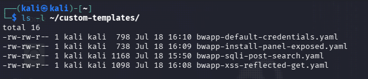

# 🧩 Plantillas personalizadas

Las plantillas públicas de `nuclei-templates` cubren miles de CVEs, exposiciones y paneles
conocidos, pero **no pueden cubrir todo**: cuando el objetivo es una aplicación con
vulnerabilidades propias (como los módulos de bWAPP en este laboratorio, que están tras login y en
rutas específicas), la única forma de que Nuclei los detecte es escribir una plantilla a medida.

Esto es precisamente uno de los puntos fuertes de Nuclei frente a escáneres cerrados: su motor de
templates en YAML es tan sencillo de extender como de usar.

---

## 1. Estructura mínima de una plantilla HTTP

```yaml
id: identificador-unico-en-minusculas

info:
  name: Nombre descriptivo
  author: tu-nombre
  severity: info|low|medium|high|critical
  description: Qué detecta y por qué
  tags: tag1,tag2

http:
  - method: GET
    path:
      - "{{BaseURL}}/ruta/al/endpoint"

    matchers:
      - type: word
        part: body
        words:
          - "cadena distintiva de la respuesta"
```

- `{{BaseURL}}` se sustituye por cada objetivo pasado con `-u`/`-l`.
- `matchers` decide si la plantilla "dispara" (encuentra el hallazgo). Se pueden combinar varios
  matchers con `matchers-condition: and` para reducir falsos positivos (por ejemplo, exigir un
  código de estado *y* una palabra concreta en el cuerpo).

---

## 2. Plantillas de este repositorio

En [`custom-templates/`](../custom-templates/) se incluyen 4 plantillas escritas específicamente
para los módulos vulnerables de bWAPP usados en el laboratorio ([`labs/lab-setup.md`](../labs/lab-setup.md)):

| Plantilla | Detecta | Técnica |
|---|---|---|
| `bwapp-sqli-post-search.yaml` | SQL Injection en `sqli_6.php` (parámetro `title`, POST) | Error-based: primero hace login (`bee`/`bug`, reutilizando cookie), luego provoca un error de sintaxis SQL y matchea el mensaje de error crudo que bWAPP no suprime en nivel Low |
| `bwapp-xss-reflected-get.yaml` | XSS reflejado en `xss_get.php` | Matchea el payload `<script>` reflejado sin escapar en la respuesta |
| `bwapp-install-panel-exposed.yaml` | Panel `install.php` expuesto | Matchea código 200 + texto distintivo de la página |
| `bwapp-default-credentials.yaml` | Credenciales por defecto `bee`/`bug` | Envía un login real por POST y matchea el redirect 302 a `portal.php` que solo ocurre si el login es correcto |

Cada una documenta en su cabecera (`info.description`, `info.reference`) de dónde sale el
comportamiento que detecta (código fuente de bWAPP), para que quede claro que no es una plantilla
genérica sino escrita a medida para este objetivo.



---

## 3. Cómo ejecutarlas

Contra una única plantilla:

```bash
nuclei -u http://192.168.184.128 -t custom-templates/bwapp-sqli-post-search.yaml -debug
```

Contra todas las plantillas personalizadas del repo de una vez:

```bash
nuclei -u http://192.168.184.128 -t custom-templates/ -jsonl -o hallazgos_bwapp.jsonl
```

Ver [`labs/ejecucion.md`](../labs/ejecucion.md) para el paso a paso dentro del flujo completo del
laboratorio.
