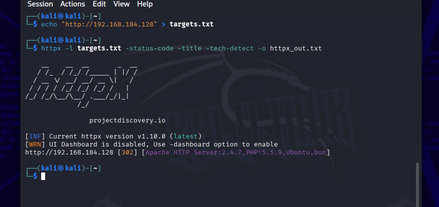
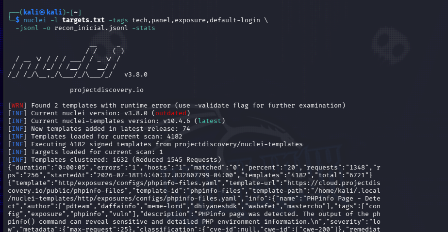
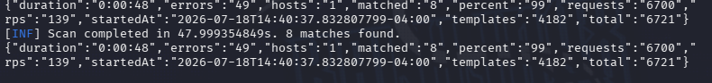
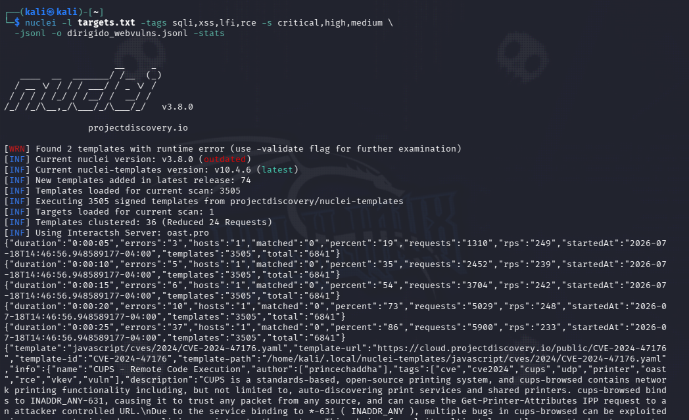
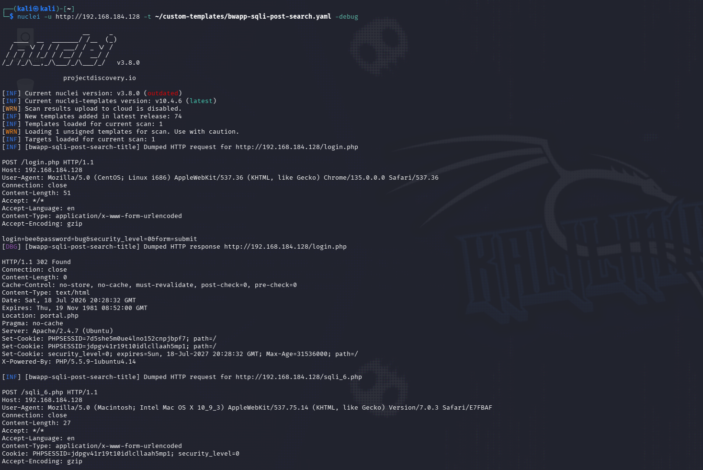
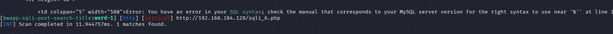
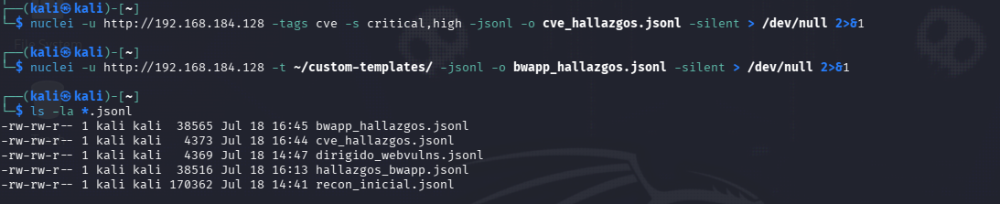
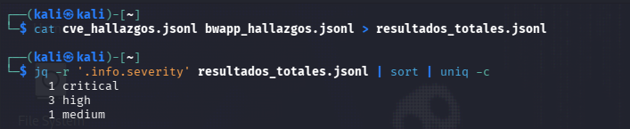

# ▶️ Ejecución del escaneo

Con el laboratorio desplegado según [`lab-setup.md`](lab-setup.md), este documento recorre la
ejecución real del escaneo contra bWAPP.

---

## 0. Preparación

```bash
# Actualizar templates antes de empezar
nuclei -update-templates

# Fichero de objetivos (ver lab-setup.md)
cat targets.txt
# http://192.168.184.128
```

---

## 1. Reconocimiento (fase enumeración/filtrado)

Al tratarse de un único host de laboratorio (no un dominio con subdominios), esta fase se
simplifica a confirmar que el activo está vivo y a extraer su fingerprint tecnológico con
`httpx`:

```bash
httpx -l targets.txt -status-code -title -tech-detect -o httpx_out.txt
```

Salida real obtenida en este laboratorio:

```
http://192.168.184.128 [302] [Apache HTTP Server:2.4.7,PHP:5.5.9,Ubuntu,bun]
```



---

## 2. Escaneo inicial (amplio)

Primer pase de reconocimiento con Nuclei, buscando tecnologías, paneles y exposiciones básicas:

```bash
nuclei -l targets.txt -tags tech,panel,exposure,default-login \
  -jsonl -o recon_inicial.jsonl -stats
```





Resultado real: 8 hallazgos, incluyendo un `phpinfo.php` expuesto y un `web.config` filtrando
credenciales de base de datos reales (`wolverine`/`Log@N`) — buena muestra de que incluso un
escaneo de reconocimiento amplio, sin plantillas dirigidas, ya aporta valor.

---

## 3. Escaneos dirigidos

En función de lo detectado (bWAPP corre sobre PHP/Apache/MySQL, con vulnerabilidades conocidas por
diseño, organizadas por categoría OWASP Top 10), se lanzan escaneos más específicos:

```bash
# Vulnerabilidades web comunes (SQLi, XSS, LFI, etc.)
nuclei -l targets.txt -tags sqli,xss,lfi,rce -s critical,high,medium \
  -jsonl -o dirigido_webvulns.jsonl -stats

# Configuraciones y credenciales por defecto
nuclei -l targets.txt -tags default-login -jsonl -o dirigido_defaultlogin.jsonl

# CVEs conocidos para el stack detectado (Apache/PHP)
nuclei -l targets.txt -tags cve -s critical,high -jsonl -o dirigido_cve.jsonl
```



Este escaneo con `-tags sqli,xss,lfi,rce` (plantillas **públicas** de `nuclei-templates`) no
encuentra los módulos específicos de bWAPP: están tras login y en rutas que ninguna plantilla
genérica puede adivinar sin conocer el objetivo de antemano. Sí detecta, en cambio, un CVE real
del propio host (CUPS, `CVE-2024-47176`) vía callback OOB, porque ese sí es un producto
ampliamente conocido con plantilla pública.

---

## 3.5. Plantillas personalizadas para los módulos de bWAPP

Cuando el objetivo tiene vulnerabilidades propias sin plantilla pública, la solución **sigue
siendo Nuclei**: se escribe una plantilla a medida. Ver
[`docs/plantillas-personalizadas.md`](../docs/plantillas-personalizadas.md) para el detalle de
cómo se construyeron las 4 plantillas en [`custom-templates/`](../custom-templates/), una por cada
módulo vulnerable de bWAPP usado en este laboratorio.

Ejecutarlas todas contra el objetivo:

```bash
nuclei -u http://192.168.184.128 -t custom-templates/ -jsonl -o hallazgos_bwapp.jsonl
```

Detalle de una plantilla en concreto con `-debug` (petición/respuesta completa):

```bash
nuclei -u http://192.168.184.128 -t custom-templates/bwapp-sqli-post-search.yaml -debug
```





Los 4 hallazgos confirmados por estas plantillas se documentan en detalle en
[`hallazgos.md`](hallazgos.md).

---

## 4. Ejecución vía pipeline automatizado

Alternativamente, todo el flujo anterior (menos la parte de subdominios, no aplicable en este
laboratorio de host único) puede lanzarse con el script incluido en el repositorio:

```bash
chmod +x ../scripts/pipeline.sh
../scripts/pipeline.sh 192.168.184.128
```

Ver [`scripts/pipeline.sh`](../scripts/pipeline.sh) para el detalle del script.

---

## 5. Recopilación de resultados

Hasta ahora hemos usado `-jsonl` sin `-o` en varios pasos (los resultados solo se imprimían por
pantalla). Para el resumen final, guardamos cada tanda de hallazgos en su propio fichero con
`-o`, y silenciamos la salida por pantalla con `-silent` (más una redirección a `/dev/null`, ya
que Nuclei sigue imprimiendo cada match por stdout aunque uses `-o` — `-o` no sustituye la salida
estándar, la complementa):

```bash
nuclei -u http://192.168.184.128 -tags cve -s critical,high -jsonl -o cve_hallazgos.jsonl -silent > /dev/null 2>&1
nuclei -u http://192.168.184.128 -t custom-templates/ -jsonl -o bwapp_hallazgos.jsonl -silent > /dev/null 2>&1
```



Con los ficheros ya guardados, los unificamos y contamos hallazgos por severidad:

```bash
# Unificar todos los resultados JSONL en un solo fichero
cat cve_hallazgos.jsonl bwapp_hallazgos.jsonl > resultados_totales.jsonl

# Contar hallazgos por severidad (requiere jq)
jq -r '.info.severity' resultados_totales.jsonl | sort | uniq -c
```



Resultado real: 1 `critical` (el SQLi), 3 `high` (CVE de CUPS, XSS, credenciales por defecto) y 1
`medium` (panel de instalación expuesto).

---

## 6. Siguiente paso

Continúa en [`hallazgos.md`](hallazgos.md) para el detalle de cada hallazgo confirmado.
