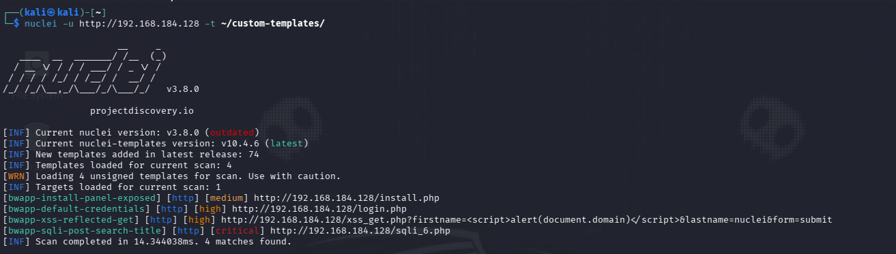
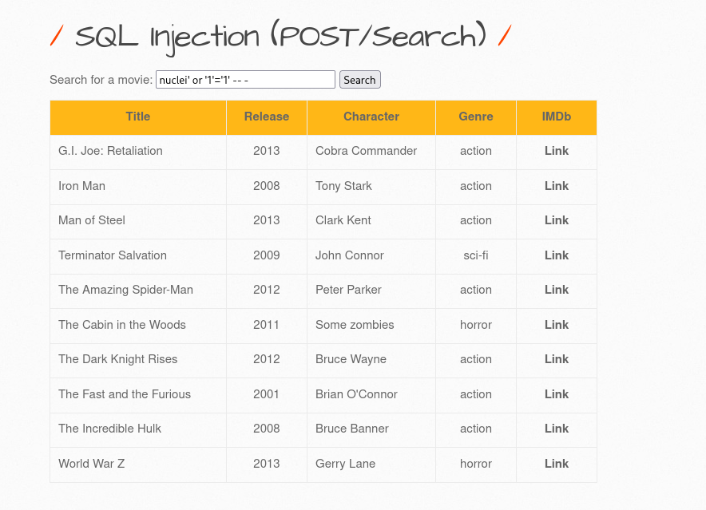

# 📑 Hallazgos del laboratorio

Documentación de los hallazgos obtenidos durante la ejecución del escaneo contra el entorno bWAPP.

Las plantillas **públicas** de `nuclei-templates` (escaneo dirigido con `-tags sqli,xss,lfi,rce`)
no detectan los módulos vulnerables propios de bWAPP: están tras login y en rutas que ninguna
plantilla genérica puede adivinar sin conocer el objetivo de antemano. Sí detectan, en cambio, un
CVE real del stack (`CVE-2024-47176`, CUPS). Para el resto de hallazgos se escribieron
**plantillas personalizadas** (ver
[`docs/plantillas-personalizadas.md`](../docs/plantillas-personalizadas.md) y
[`custom-templates/`](../custom-templates/)) — Nuclei sigue siendo la herramienta que detecta cada
hallazgo, solo que con una plantilla escrita a medida cuando la pública no existe.

---

## Tabla de hallazgos

| Vulnerabilidad                          | Severidad | Plantilla Nuclei                     | Descripción                                                                 | Impacto                                                              | Estado de validación |
|-------------------------------------------|-----------|-------------------------------------------------|---------------------------------------------------------------------------------|---------------------------------------------------------------------------|-------------------------|
| CVE-2024-47176 — CUPS Remote Code Execution | Alta (CVSS 8.3) | `javascript/cves/2024/CVE-2024-47176.yaml` (pública) | El servicio `cups-browsed` del host Ubuntu escucha en `0.0.0.0:631` y confía en peticiones IPP de cualquier origen, permitiendo introducir una impresora maliciosa. | Podría permitir ejecución remota de comandos al iniciarse un trabajo de impresión con la impresora maliciosa. | ✅ Confirmado por Nuclei (callback OOB vía Interactsh recibido) |
| SQL Injection (POST/Search)                | Crítica    | `custom-templates/bwapp-sqli-post-search.yaml` (personalizada) | El parámetro `title` del módulo SQLi de bWAPP (`sqli_6.php`) no sanitiza correctamente la entrada, provocando un error de SQL crudo en la respuesta. | Permite extraer datos de la base de datos, incluidas credenciales de usuarios.| ✅ Confirmado por Nuclei |
| Cross-Site Scripting (XSS) reflejado (GET) | Alta       | `custom-templates/bwapp-xss-reflected-get.yaml` (personalizada) | Los parámetros `firstname`/`lastname` del módulo XSS de bWAPP (`xss_get.php`) reflejan el input sin escapar en el HTML. | Ejecución de JavaScript arbitrario en el contexto de la víctima (robo de sesión).| ✅ Confirmado por Nuclei |
| Panel de instalación/reset expuesto sin protección adicional | Media | `custom-templates/bwapp-install-panel-exposed.yaml` (personalizada) | Panel de instalación/reset de base de datos de bWAPP (`install.php`) accesible sin restricción de red. | Facilita reconocimiento y manipulación de la configuración de la app. | ⚠️ Confirmado, riesgo contextual (laboratorio) |
| Credenciales por defecto activas           | Alta       | `custom-templates/bwapp-default-credentials.yaml` (personalizada) | Las credenciales `bee`/`bug` documentadas por defecto siguen activas.           | Acceso administrativo completo a la aplicación.                          | ✅ Confirmado por Nuclei |

---

## Detalle de hallazgos

### Hallazgo 0 — CVE-2024-47176 (CUPS Remote Code Execution)

- **Severidad**: Alta (CVSS 3.1: 8.3)
- **Plantilla Nuclei**: `javascript/cves/2024/CVE-2024-47176.yaml` (pública)
- **Objetivo afectado**: `192.168.184.128:631` (servicio `cups-browsed` del host Ubuntu, no de
  bWAPP en sí)
- **Descripción técnica**: `cups-browsed` escucha en `INADDR_ANY:631` y confía en paquetes UDP de
  cualquier origen. Encadenado con otros bugs de CUPS, permite introducir una impresora maliciosa
  cuya URI apunta a un servidor controlado por el atacante, logrando ejecución de comandos cuando
  se inicia un trabajo de impresión.
- **Evidencia**: ver [`images/lab-nuclei-scan-dirigido.png`](../images/lab-nuclei-scan-dirigido.png)
  en [`ejecucion.md`](ejecucion.md) — ahí queda documentado el escaneo dirigido que lo detectó.
- **Impacto**: Ejecución remota de código sin autenticación en el host que aloja el laboratorio.
- **Estado de validación**: ✅ Confirmado por Nuclei — la plantilla usa un callback OOB
  (Interactsh) que recibió la interacción, confirmando la vulnerabilidad automáticamente.

---

### Hallazgo 1 — SQL Injection (POST/Search)

- **Severidad**: Crítica
- **Plantilla Nuclei**: `custom-templates/bwapp-sqli-post-search.yaml` (personalizada — ver
  [`docs/plantillas-personalizadas.md`](../docs/plantillas-personalizadas.md))
- **URL afectada**: `POST http://192.168.184.128/sqli_6.php` con body `title=nuclei'&action=search`
- **Descripción técnica**: El parámetro `title` se concatena directamente en la consulta SQL sin
  sanitizar. Un payload que rompe la sintaxis (`title=nuclei'`) provoca un `mysql_error()` sin
  gestionar que bWAPP muestra en crudo en la respuesta: `Error: You have an error in your SQL
  syntax; check the manual that corresponds to your MySQL server version for the right syntax to
  use near '%'' at line 1` — confirmado en vivo contra el laboratorio real. Un payload de bypass
  booleano (`nuclei' or '1'='1' -- -`) confirma además el impacto real: en vez de filtrar por
  título, la consulta devuelve **todas las películas** de la base de datos, demostrando control
  total sobre la cláusula `WHERE`.
- **Evidencia**:

  

  

- **Impacto**: Compromiso de confidencialidad e integridad de los datos almacenados en la base de
  datos de la aplicación — el bypass booleano ya demuestra que un atacante controla completamente
  qué filas devuelve la consulta, y el mismo vector permite escalar a extracción de datos vía
  `UNION SELECT`.
- **Estado de validación**: ✅ Confirmado por Nuclei (mensaje de error SQL crudo recibido en la
  respuesta real) y reproducido en el navegador con un bypass booleano exitoso (`or '1'='1'`),
  confirmando impacto real más allá del simple error de sintaxis.

---

### Hallazgo 2 — Cross-Site Scripting (XSS) reflejado (GET)

- **Severidad**: Alta
- **Plantilla Nuclei**: `custom-templates/bwapp-xss-reflected-get.yaml` (personalizada)
- **URL afectada**: `http://192.168.184.128/xss_get.php?firstname=&lastname=nuclei&form=submit`
- **Descripción técnica**: El parámetro `firstname` se refleja directamente en el HTML de
  respuesta sin codificar caracteres especiales; la plantilla matchea el payload `<script>`
  reflejado verbatim.
- **Evidencia**: ver [`images/hallazgo-bwapp-nuclei.png`](../images/hallazgo-bwapp-nuclei.png)
  (captura consolidada de las 4 plantillas, hallazgo 1).
- **Impacto**: Posible robo de cookies de sesión o ejecución de acciones en nombre de la víctima.
- **Estado de validación**: ✅ Confirmado por Nuclei.

---

### Hallazgo 3 — Panel de instalación/reset expuesto

- **Severidad**: Media
- **Plantilla Nuclei**: `custom-templates/bwapp-install-panel-exposed.yaml` (personalizada)
- **URL afectada**: `http://192.168.184.128/install.php`
- **Descripción técnica**: El panel de instalación/reset de base de datos de bWAPP es accesible
  sin autenticación previa; la plantilla matchea el código 200 junto al texto distintivo de la
  página.
- **Evidencia**: ver [`images/hallazgo-bwapp-nuclei.png`](../images/hallazgo-bwapp-nuclei.png)
  (captura consolidada de las 4 plantillas, hallazgo 1).
- **Impacto**: En un entorno real (no de laboratorio), podría permitir a un atacante resetear el
  estado de la aplicación o obtener información de configuración sensible.
- **Estado de validación**: ⚠️ Confirmado, riesgo contextual — aceptable en laboratorio, crítico
  si se replicase en producción.

---

### Hallazgo 4 — Credenciales por defecto activas

- **Severidad**: Alta
- **Plantilla Nuclei**: `custom-templates/bwapp-default-credentials.yaml` (personalizada)
- **URL afectada**: `http://192.168.184.128/login.php`
- **Descripción técnica**: Las credenciales de instalación por defecto (`bee` / `bug`) no han sido
  modificadas; la plantilla envía un login real por POST y matchea el redirect 302 a `portal.php`
  que solo ocurre si las credenciales son correctas.
- **Evidencia**: ver [`images/hallazgo-bwapp-nuclei.png`](../images/hallazgo-bwapp-nuclei.png)
  (captura consolidada de las 4 plantillas, hallazgo 1).
- **Impacto**: Acceso administrativo total sin necesidad de explotar ninguna otra vulnerabilidad.
- **Estado de validación**: ✅ Confirmado por Nuclei (redirect 302 a `portal.php` recibido).

---
