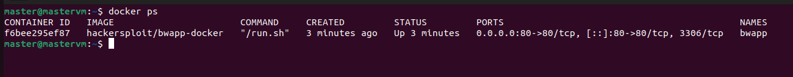
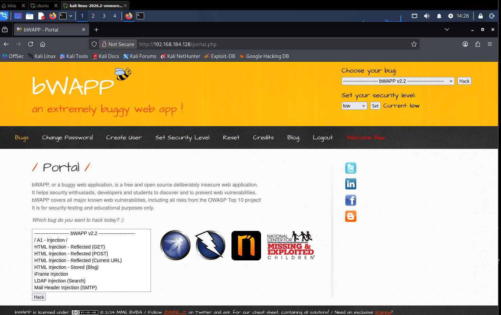

# 🏗️ Arquitectura del laboratorio

Este laboratorio reproduce un escenario mínimo pero realista de análisis de vulnerabilidades web,
usando dos máquinas virtuales en una red aislada.

---

## ⚠️ Alcance del laboratorio

Este entorno es **100% local y aislado**, sin conexión a redes externas ni a internet más allá de
lo estrictamente necesario para instalar paquetes. No se escanea ningún activo real ni de
terceros.

---

## 1. Componentes

| Rol         | Sistema operativo     | Software instalado                        | Función                                   |
|--------------|-------------------------|----------------------------------------------|-----------------------------------------------|
| Atacante     | Kali Linux 2026.2        | `subfinder`, `httpx`, `nuclei`                 | Máquina de reconocimiento y escaneo            |
| Víctima      | Ubuntu 22.04      | Docker + bWAPP (buggy Web APPlication)         | Aplicación web deliberadamente vulnerable      |

---

## 2. Diagrama de red

```
                        Red NAT de VMware (adaptador compartido)
                                 192.168.184.0/24
   ┌────────────────────────┐                     ┌────────────────────────┐
   │   Kali Linux (Atacante) │                     │  Ubuntu (Víctima)│
   │   IP: 192.168.184.130   │  ───────────────>   │  IP: 192.168.184.128    │
   │                          │                     │                          │
   │  - subfinder             │                     │  - Docker Engine         │
   │  - httpx                 │                     │  - bWAPP (puerto 80)     │
   │  - nuclei                │                     │                          │
   └────────────────────────┘                     └────────────────────────┘
```

- **Red**: adaptador NAT de VMware en ambas VMs (ver nota más abajo sobre por qué NAT basta aquí).
- **IP atacante (Kali)**: `192.168.184.130` (asignada por DHCP, puede variar si se reinicia la VM).
- **IP víctima (Ubuntu + bWAPP)**: `192.168.184.128` (asignada por DHCP, puede variar si se
  reinicia la VM).

> Las IPs anteriores son las reales de este laboratorio concreto (DHCP de VMware). Si las tuyas
> son distintas, ajusta los comandos del resto de la guía en consecuencia.

En este laboratorio concreto ambas VMs se desplegaron en **VMware Workstation Pro** con el
adaptador de red en modo **NAT**: VMware comparte el mismo switch virtual entre todas las VMs
conectadas en modo NAT, por lo que Kali y Ubuntu se alcanzan entre sí sin necesidad de configurar
una red interna aparte. La conectividad se verificó con un `ping` desde Kali hacia la IP de Ubuntu
antes de continuar con el despliegue de bWAPP.

---

## 3. Despliegue de la máquina víctima (Ubuntu + bWAPP en Docker)

En la VM Ubuntu:

```bash
# Instalar Docker
sudo apt update
sudo apt install -y docker.io
sudo systemctl enable --now docker

# Descargar y ejecutar bWAPP
sudo docker run -d --name bwapp -p 80:80 hackersploit/bwapp-docker
```

Verifica que el contenedor está corriendo:

```bash
sudo docker ps
```



Desde la máquina atacante, comprueba conectividad:

```bash
curl -I http://192.168.184.128
```

Deberías recibir una respuesta HTTP 200 (o redirección a `install.php`/`login.php`), confirmando
que bWAPP está accesible.

### Configuración inicial de bWAPP

1. Accede desde el navegador de Kali a `http://192.168.184.128/install.php` y sigue el enlace para
   crear la base de datos (equivalente al `setup.php` de otras apps vulnerables).
2. Inicia sesión en `http://192.168.184.128/login.php` con las credenciales por defecto: `bee` /
   `bug`.
3. En el menú principal, configura el **nivel de seguridad** deseado (`low` para las primeras
   pruebas, subiendo progresivamente a `medium`/`high` para comparar resultados) y selecciona el
   "bug" (módulo de vulnerabilidad) a explorar en cada caso.



---

## 4. Preparación de la máquina atacante (Kali)

Sigue [`docs/instalacion.md`](../docs/instalacion.md) para instalar `subfinder`, `httpx` y
`nuclei`. Adicionalmente, para este laboratorio local, prepara un fichero de objetivos:

```bash
echo "http://192.168.184.128" > targets.txt
```

---

Siguiente paso: [`ejecucion.md`](ejecucion.md) — ejecución real del escaneo.
